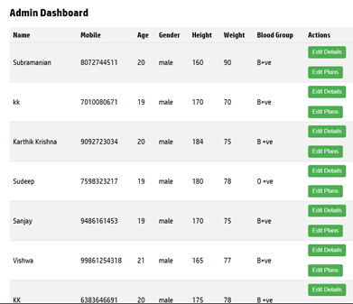
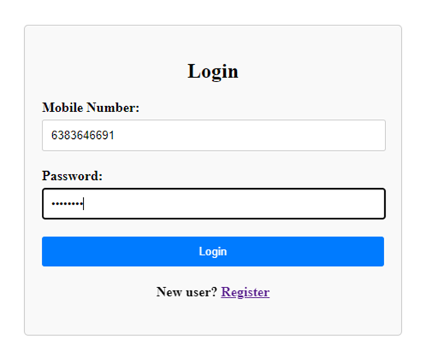
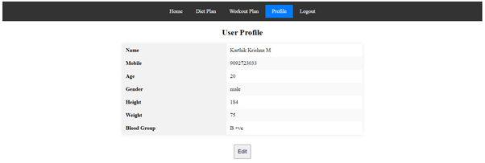

# Fitness Training Studio

## Overview

The **Fitness Training Studio** application is a comprehensive web-based platform designed to cater to the fitness needs of modern individuals by providing personalized diet and workout plans. Built using the MEAN stack (MongoDB, Express.js, Angular, and Node.js), this application allows users to register, manage their profiles, and access customized fitness plans. The system also includes an administrative interface for managing user data and updating fitness plans.

## Problem Identification

Modern lifestyles often lead to unhealthy habits, resulting in a need for a comprehensive fitness solution that provides personalized diet and workout plans. The **Fitness Training Studio** application addresses this need by offering users a platform to register, manage their profiles, and access customized fitness plans, while also facilitating administrative control over user data and fitness plans to ensure the recommendations are effective and up-to-date.

## Software Requirements Specification (SRS)

### Purpose
To create an application that allows users to manage their fitness journey through personalized diet and workout plans and allows administrators to manage user data.

### Scope
The application includes functionalities for:
- User registration
- Login
- Profile management
- Diet plan viewing
- Workout plan viewing
- Administrative controls

### Functional Requirements
- **User Registration**: Users can register by providing personal details.
- **User Login**: Users can log in using their mobile number and password.
- **Profile Management**: Users can view and update their profile information.
- **Diet Plan**: Users can view their personalized diet plan.
- **Workout Plan**: Users can view their personalized workout plan.
- **Admin Dashboard**: Admins can view, search, and update user details and plans.

### Non-Functional Requirements
- **Security**: User data must be securely stored and transmitted.
- **Performance**: The application should be responsive and load quickly.
- **Usability**: The application should be easy to navigate and use.

## Modules

1. **Authentication Module**
   - User Registration
   - User Login
   - Authentication Service

2. **User Profile Module**
   - Profile Management
   - Diet Plan Viewing
   - Workout Plan Viewing

3. **Admin Module**
   - Admin Login
   - User Data Management
   - Diet and Workout Plan Management

4. **Database Module**
   - User Schema
   - Diet Plan Schema
   - Workout Plan Schema

## Implemented Functionalities and Users of the System

### Implemented Functionalities
- **User Registration**: Allows new users to sign up and create a profile.
- **User Login**: Authenticates users and grants access to their dashboard.
- **Profile Management**: Users can update their personal information.
- **Diet Plan Viewing**: Displays personalized diet plans for users.
- **Workout Plan Viewing**: Displays personalized workout plans for users.
- **Admin Dashboard**: Admins can view, search, and edit user details and plans.

### Users of the System
- **End Users**: Individuals seeking to manage their fitness through personalized plans.
- **Administrators**: Personnel responsible for managing user data and updating fitness plans.

## Screenshots of Output

### Admin Interface

**Admin Login:**

**Admin Dashboard:**

**Admin Edit Details and Plans:**

### User Interface

**User Register:**

**User Login:**

**Home Page:**

**Diet Plan:**

**Workout Plan:**

**Profile Editing:**

## Concepts Used in MongoDB, Express.js, Angular, and Node.js

### MongoDB
- **Schema Design**: Defining schemas for users, diet plans, and workout plans.
- **Data Storage**: Storing user information and fitness plans in a NoSQL database.

### Express.js
- **Routing**: Handling HTTP requests and defining routes for user and admin functionalities.
- **Middleware**: Using middleware for request parsing, authentication, and error handling.

### Angular
- **Component-Based Architecture**: Building reusable components for registration, login, profile, diet plan, and workout plan.
- **Services**: Implementing services for HTTP communication and user authentication.
- **Routing**: Managing navigation within the application using Angular Router.

### Node.js
- **Server Setup**: Creating a server to handle requests and serve the application.
- **API Development**: Developing RESTful APIs for user registration, login, profile management, and admin functionalities.

## Future Enhancements

### Personalized Recommendations
- **AI Integration**: Use machine learning algorithms to provide more personalized diet and workout recommendations based on user data and preferences.
- **Adaptive Plans**: Develop adaptive plans that adjust based on user feedback and progress.

### Advanced User Analytics
- **Progress Tracking**: Add detailed progress tracking features, including graphs and charts to visualize user progress over time.
- **Health Metrics**: Integrate additional health metrics such as heart rate, sleep patterns, and calories burned.

### Social Features
- **Community Forum**: Implement a community forum where users can interact, share their experiences, and motivate each other.
- **Social Sharing**: Allow users to share their progress and achievements on social media platforms.

### Mobile Application
- **Native Mobile Apps**: Develop native iOS and Android applications to provide a seamless experience across all devices.
- **Push Notifications**: Implement push notifications to remind users about their workouts, mealtimes, and important updates.

### Enhanced Security
- **Two-Factor Authentication**: Implement two-factor authentication to enhance security for user accounts.
- **Data Encryption**: Ensure all sensitive data is encrypted both in transit and at rest.

## Let's Connect!
🌐 LinkedIn: https://www.linkedin.com/in/subramanian-s-ab94302a1/ & https://www.linkedin.com/in/karthik-krishna-m/

📧 Email: subramanian160104@gmail.com & karthikkrishna230104@gmail.com

Feel free to clone the repository, contribute, or raise issues. We welcome all contributions to improve and enhance the **Fitness Training Studio** application.
